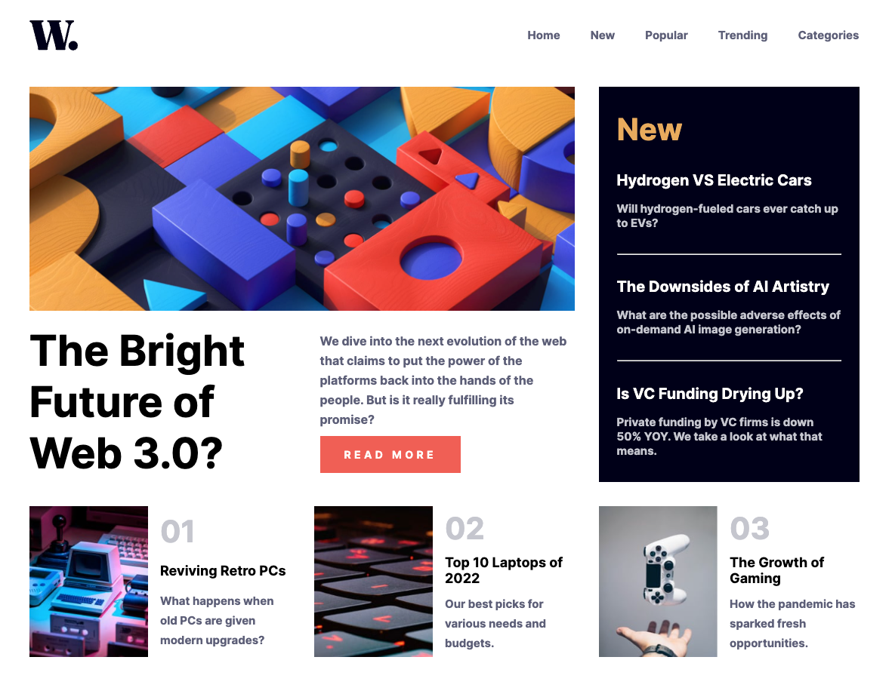
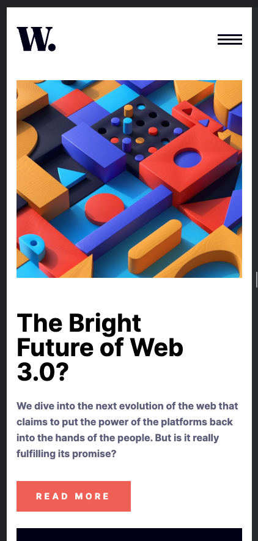
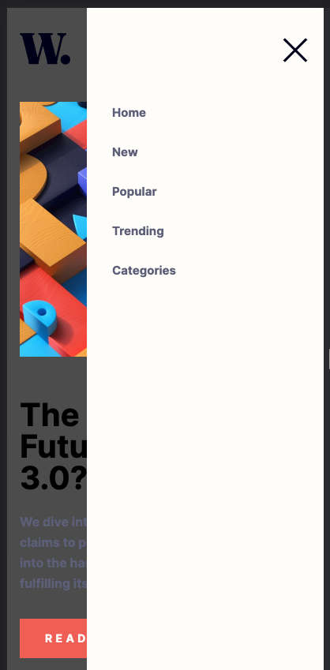

# Frontend Mentor - News homepage solution

This is a solution to the [News homepage challenge on Frontend Mentor](https://www.frontendmentor.io/challenges/news-homepage-H6SWTa1MFl).

## Overview

### The challenge

Users should be able to:

- View the optimal layout for the interface depending on their device's screen size
- See hover and focus states for all interactive elements on the page

### Screenshot

### Links

- Solution URL: [Github Code](https://github.com/lastiwan89/fem-news-homepage)
- Live Site URL: [Netlify](https://64d8f8927408bc2ae289cc87--starlit-taffy-47f949.netlify.app/)

## My process

### Built with

- Semantic HTML5 markup
- Sass custom properties
- Flexbox
- CSS Grid
- Gulp for compiling Scss file

### What I learned

I learn a lot more css grid that combined with flexbox.

## Author

- Frontend Mentor - [@yourusername](https://www.frontendmentor.io/profile/lastiwan89)

## Acknowledgments

This project i build myself
